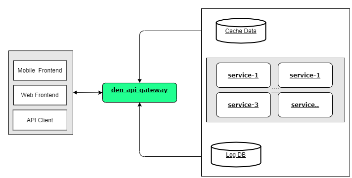

# DenProx

## Table of Contents
- [Introducing](#introducing)
- [Position Api Gateway Scheme](#position-api-gateway-scheme)
- [Basic Requirements](#basic-requirements)
- [Directory Structure](#directory-structure)
- [Coding Guidelines](#coding-guidelines) 
- [Simple Guide Documentation Branch Repository](#simple-guide-documentation-branch-repository)
- [Roadmap](#roadmap) 
- [Contact](#contact)
- [License](#license)
  
## Introducing

DenProx Api Gateway is a gateway to handle RESTful API & Reverse Proxy & Single Sign On Application written using the nodejs programming language.

## Position Api Gateway Scheme

## Basic Requirements

Version nodejs: >= v14.15.3
version mongodb: >= v.6.0
versin redis: >= 5.0.0

## Directory Structure

<pre><code>
├── app
    └── config
    └── model
├── lib
    └── *.go
├── test
├── node_modules
└── server-login.js
└── server.js
</code></pre>

- app/Config/       : Place for all global config 
- app/config/lib    : Place for all global function
- test/             : Place for unit test & integration test
- server-login.js   : Script for logic login gateway
- server.js         : Script for logic proxy

## Coding Guidelines ##

## Simple Guide Documentation Branch Repository

1. The **dev-x.x.x** branch corresponds to the release actively under development.
2. The **stable-x.X.x** branches correspond to stable releases.
3. Create a branch based on **dev.x.x.x** and set up a development environment if you want to open a PR by issue (feature / bug).

   example: **dev-v.1.1.0-feature-use-linter-code-group-lib-and-file-server-js**

## Roadmap
Based on team and community feedback, an initial roadmap will be published for a major or minor version (ex: 1.0.0, 1.1.0). The Roadmap page details what is planned and how to influence the roadmap.
you can see in : 
1. [GitHub Projects for den-api-gateway](https://github.com/dendie-sanjaya/den-api-gateway/projects?query=is%3Aopen)
2. [GitHub Milestones for den-api-gateway](https://github.com/dendie-sanjaya/den-api-gateway/milestones)

## Contact & Author

DenPro was created by Dendie and has many contributions  Thanks everyone!

If you have question, you can contact this email   
Email: dendie.sanjaya@gmail.com

## License

This project is licensed under the [Apache License 2.0](https://www.apache.org/licenses/LICENSE-2.0)
